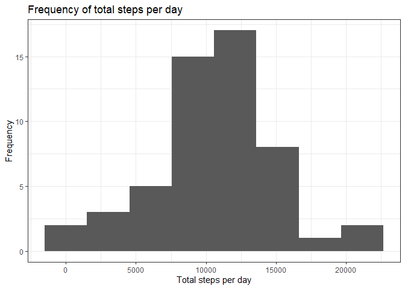
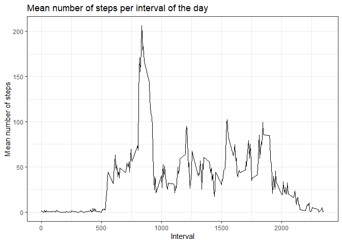
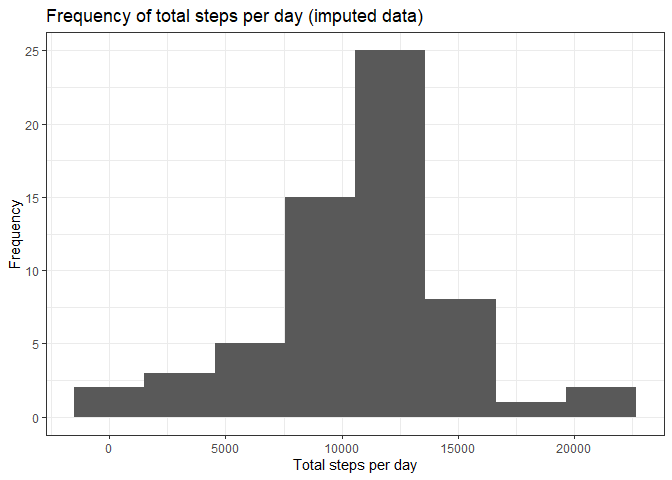
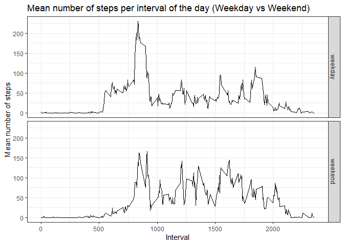

This is my submission to the first Peer Assessment of the Reproducible Research course
on Coursera.


## Loading and preprocessing the data

Using *tidyverse* for convenience.

```r
if (!require("tidyverse")){
    install.packages("tidyverse")
    library(tidyverse)
}
```

- Load the data (i.e. read.csv())

Unziping and loading the dataset as a tibble.

```r
unzip("activity.zip")

data <- read_csv("activity.csv")
data
```

```
## # A tibble: 17,568 × 3
##    steps date       interval
##    <dbl> <date>        <dbl>
##  1    NA 2012-10-01        0
##  2    NA 2012-10-01        5
##  3    NA 2012-10-01       10
##  4    NA 2012-10-01       15
##  5    NA 2012-10-01       20
##  6    NA 2012-10-01       25
##  7    NA 2012-10-01       30
##  8    NA 2012-10-01       35
##  9    NA 2012-10-01       40
## 10    NA 2012-10-01       45
## # … with 17,558 more rows
```


- Process/transform the data (if necessary) into a format suitable for your analysis

Joined the **date** and **interval** columns into a **datetime** column.


```r
datetime = strptime(paste(data$date, sprintf("%04d", data$interval)), "%Y-%m-%d %H%M")

clean_data = tibble(datetime=datetime, steps=data$steps)
clean_data
```

```
## # A tibble: 17,568 × 2
##    datetime            steps
##    <dttm>              <dbl>
##  1 2012-10-01 00:00:00    NA
##  2 2012-10-01 00:05:00    NA
##  3 2012-10-01 00:10:00    NA
##  4 2012-10-01 00:15:00    NA
##  5 2012-10-01 00:20:00    NA
##  6 2012-10-01 00:25:00    NA
##  7 2012-10-01 00:30:00    NA
##  8 2012-10-01 00:35:00    NA
##  9 2012-10-01 00:40:00    NA
## 10 2012-10-01 00:45:00    NA
## # … with 17,558 more rows
```


## What is mean total number of steps taken per day?

- Calculate the total number of steps taken per day

```r
data_per_day <- data %>% group_by(date) %>% summarise(total=sum(steps))
data_per_day
```

```
## # A tibble: 61 × 2
##    date       total
##    <date>     <dbl>
##  1 2012-10-01    NA
##  2 2012-10-02   126
##  3 2012-10-03 11352
##  4 2012-10-04 12116
##  5 2012-10-05 13294
##  6 2012-10-06 15420
##  7 2012-10-07 11015
##  8 2012-10-08    NA
##  9 2012-10-09 12811
## 10 2012-10-10  9900
## # … with 51 more rows
```
- Make a histogram of the total number of steps taken each day

```r
library(ggplot2)

qplot(data_per_day$total, 
      geom="histogram", 
      bins = 8, 
      xlab = "Total steps per day", 
      ylab = "Frequency", 
      main = "Frequency of total steps per day") + 
    theme_bw()
```

<!-- -->


- Calculate and report the mean and median of the total number of steps taken per day


```r
mean_steps_per_day <- mean(data_per_day$total, na.rm = TRUE) # 10766.19
median_steps_per_day <- median(data_per_day$total, na.rm = TRUE) # 10765
```

Mean of the total number of steps taken per day: 10 766.19  
Median of the total number of steps taken per day: 10 765

## What is the average daily activity pattern?

- Make a time series plot (i.e. type = "l") of the 5-minute interval (x-axis) and the average number of steps taken, averaged across all days (y-axis)


```r
data_per_interval <- data %>% group_by(interval) %>% summarise(mean=mean(steps, na.rm=TRUE))
qplot(data_per_interval$interval,
      data_per_interval$mean,
      geom = "path",
      xlab = "Interval", 
      ylab = "Mean number of steps", 
      main = "Mean number of steps per interval of the day") + 
    theme_bw()
```

<!-- -->


- Which 5-minute interval, on average across all the days in the dataset, contains the maximum number of steps?


```r
max_average_steps <- max(data_per_interval$mean) # 206.17

max_average_steps_interval <- data_per_interval[max_average_steps == data_per_interval$mean,]$interval[1] # 835
```

The 5-minute interval that, on average, contains the maximum number of steps is: 835

## Imputing missing values

- Calculate and report the total number of missing values in the dataset (i.e. the total number of rows with NAs)

I first check which columns contain NAs.

```r
NAs_in_steps <- sum(is.na(data$steps))          # 2304
NAs_in_date <- sum(is.na(data$date))            # 0
NAs_in_interval <- sum(is.na(data$interval))    # 0
```

Since the **date** and **interval** columns contain no NAs, we can conclude that the total number of rows with NAs is equal to the total number of NAs in **steps**, i.e. 2304.

- Devise a strategy for filling in all of the missing values in the dataset. The strategy does not need to be sophisticated. For example, you could use the mean/median for that day, or the mean for that 5-minute interval, etc.

I will impute the missing values with the mean for that particular interval.

- Create a new dataset that is equal to the original dataset but with the missing data filled in.


```r
imputed_data <- data

for (i in 1:length(imputed_data$steps)) {
    if (is.na(imputed_data$steps[i])){
        imputed_data$steps[i] <- data_per_interval$mean[which(data_per_interval$interval == imputed_data$interval[i])]
    }
}

# Check that there are no NAs left in the dataset
sum(is.na(imputed_data)) == 0
```

```
## [1] TRUE
```


- Make a histogram of the total number of steps taken each day and Calculate and report the mean and median total number of steps taken per day. Do these values differ from the estimates from the first part of the assignment? What is the impact of imputing missing data on the estimates of the total daily number of steps?


```r
impdata_per_day <- imputed_data %>% group_by(date) %>% summarise(total=sum(steps))
qplot(impdata_per_day$total, 
      geom="histogram", 
      bins = 8, 
      xlab = "Total steps per day", 
      ylab = "Frequency", 
      main = "Frequency of total steps per day (imputed data)") + 
    theme_bw()
```

<!-- -->


```r
impmean_steps_per_day <- mean(impdata_per_day$total) # 10766.19
impmedian_steps_per_day <- median(impdata_per_day$total) # 10766.19
```

We notice that the mean number of steps per day and the median number of steps per day remain virtually identical to the non imputed data.

Where we can find noticeable differences is on the histogram. Since most NAs came from whole missing days, imputing the data has effectively added entirely new "average" days.

## Are there differences in activity patterns between weekdays and weekends?

- Create a new factor variable in the dataset with two levels – “weekday” and “weekend” indicating whether a given date is a weekday or weekend day.


```r
imputed_data <- mutate(imputed_data, 
                       daytype = sapply( weekdays(date, T),
                                           function(x){
                                                if(x %in% c("Sat", "Sun")) {
                                                    return ("weekend")
                                                }
                                                else {
                                                    return ("weekday")
                                                }
                                            }
                                           ))
imputed_data
```

```
## # A tibble: 17,568 × 4
##     steps date       interval daytype
##     <dbl> <date>        <dbl> <chr>  
##  1 1.72   2012-10-01        0 weekday
##  2 0.340  2012-10-01        5 weekday
##  3 0.132  2012-10-01       10 weekday
##  4 0.151  2012-10-01       15 weekday
##  5 0.0755 2012-10-01       20 weekday
##  6 2.09   2012-10-01       25 weekday
##  7 0.528  2012-10-01       30 weekday
##  8 0.868  2012-10-01       35 weekday
##  9 0      2012-10-01       40 weekday
## 10 1.47   2012-10-01       45 weekday
## # … with 17,558 more rows
```


- Make a panel plot containing a time series plot (i.e. type = "l") of the 5-minute interval (x-axis) and the average number of steps taken, averaged across all weekday days or weekend days (y-axis). See the README file in the GitHub repository to see an example of what this plot should look like using simulated data.


```r
impdata_per_interval <- imputed_data %>% 
                         group_by(interval, daytype) %>%
                         summarise(mean=mean(steps))


qplot(data = impdata_per_interval,
      x=interval, 
      y=mean, 
      geom = "path", 
      facets = daytype ~ .,
      xlab = "Interval", 
      ylab = "Mean number of steps", 
      main = "Mean number of steps per interval of the day (Weekday vs Weekend)") +
    theme_bw()
```

<!-- -->

